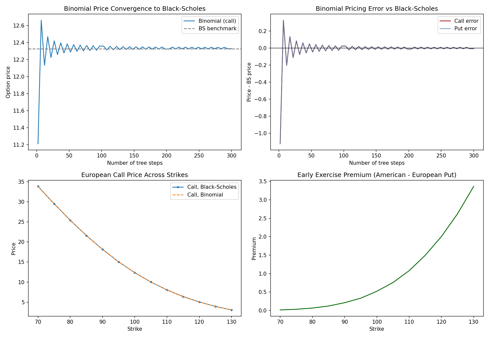

# options-pricing-binomial-blackscholes
Binomial tree and Black-Scholes option pricing models built from scratch in Python — compares outputs across strikes, maturities, and volatility, and analyses convergence behaviour as tree depth increases.

